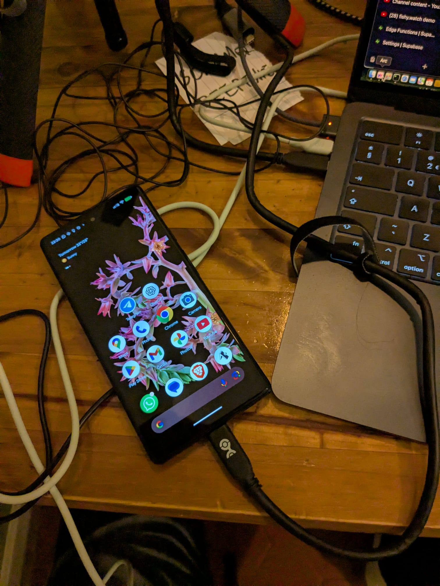

# Fishy.watch

<p align="center">
  
</p>

<p align="center">
<b>2FA network against phishing</b>
</p>

<p align="center">
<p align="center">
  <a href="#key-features">Key Features</a> •
  <a href="#requirements">Requirements</a> •
  <a href="#quick-start">Quick Start</a> •
  <a href="#development-setup">Development Setup</a> •
  <a href="#credits">Credits</a>
  <a href="#related">Related</a>
  <a href="#about-the-core-contributors">About the Core Contributors</a>
</p>

</p>

<p align="center">
  
  
  

</p>

<p align="center">
  
</p>


--- 

<p align="center">
  
</p>

## Key Features

- Protect your loved ones who are tech-illiterate from deepfake phishing calls! 🛡️
- Prevent fraud, tight social engineering security via NFC-cryptographic key exchange, by touching grass 🌿
- 2FA network to catch discrepancies between high-trust networked devices
- **Proximity-based key exchange** using NFC or Nearby Connections for secure device pairing
- **Real-time call monitoring** with Android call screening integration
- **Voice authentication** with biometric verification

## Requirements

- [ElevenLabs API](https://elevenlabs.io) 
- Android devices for proximity-based features (NFC/Nearby Connections)
- Android 10+ for call screening functionality

## Quick Start (demo)

1. **Pairing**: Connect phones in person via NFC or Nearby Connections to safely exchange cryptographic key pairs
2. **Voice Registration**: Register each other's voice during the pairing process - audio signatures stored on-device
3. **Active Monitoring**: fishy.watch continuously monitors calls and checks network state when suspicious activity detected
4. **Intervention**: If social engineering attack detected, actively warns the victim they are likely being phished

### For Android Proximity Features (Custom Development Build)

The proximity-based features (NFC and Nearby Connections) require a custom development build and cannot be tested in Expo Go.

#### Prerequisites
- Android Studio installed
- Android device with USB debugging enabled
- Android SDK and build tools

#### Setup Steps

1. **Connect your android phone to the pc**

<p align="center">
  
</p>


2. **Run this**
```bash
make build-and-run-on-connected-android-device
```

This will:
- Build a custom version of your app with all native modules
- Install it on your connected Android device
- Start the development server

#### Testing Proximity Features

Once the custom build is installed:
1. Open the custom app on both Android devices
2. Navigate to the Key Exchange tab
3. Choose "Nearby Device" to test Bluetooth-based proximity pairing
4. Devices should discover each other when in close proximity

#### Permissions Required

The app requires these Android permissions for proximity features:
- `ACCESS_COARSE_LOCATION` - For Bluetooth device discovery
- `ACCESS_FINE_LOCATION` - For precise location-based services
- `BLUETOOTH` - For Bluetooth communication
- `BLUETOOTH_ADMIN` - For Bluetooth device management
- `ACCESS_WIFI_STATE` - For WiFi-based discovery
- `CHANGE_WIFI_STATE` - For WiFi configuration

## Architecture

### Key Exchange Methods
1. **NFC Exchange**: Tap devices together for instant key exchange
2. **Nearby Connections**: Bluetooth-based discovery and pairing for devices in proximity
3. **Simulation Mode**: For testing and demonstration purposes

### Security Features
- **Cryptographic Key Exchange**: Secure ECDH-based key generation and exchange
- **Device Authentication**: Unique device fingerprinting and verification
- **Voice Biometrics**: On-device voice pattern analysis and matching
- **Network Verification**: Cross-device state verification for call authenticity

## Credits

This software uses the following tools:
- [Cursor: The AI Code Editor](cursor.com)
- [LangFuse: LLM Observability Tool](https://langfuse.com/)
- [Expo Nearby Connections](https://docs.expo.dev/versions/latest/sdk/nearby-connections/) for proximity-based device discovery
